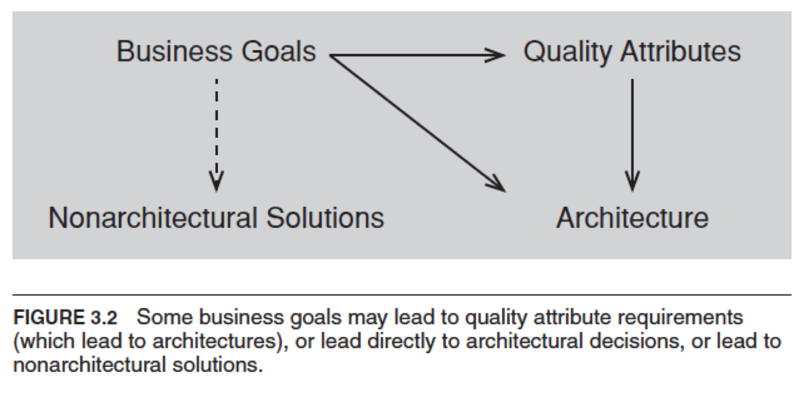

## Contexts

### [Technical Context](#)
- Set of **quality attributes** the architecture can help to achieve
- The architecture's current **technical environment**
   - Standard industry practices
   - Software engineering techniques
   - e.g. Web-based, object-oriented, service-oriented and cloud-based

### [Project Life-Cycle Context](#)
- **Software development processes** include design (Part of architecture) among their obligations
   - Waterfall
   - Iterative
   - Agile
   - Model-driven development
- **Architecture activities** are used to realise a complete design, implement and manage the evolution of a system
   1. Make business case
   2. Understand architecturally significant requirements (ASR)
   3. Create or select architecture
   4. Document and communicate architecture
   5. Analyse or evaluate architecture
   6. Implement and test system based on architecture
   7. Ensure implementation conforms to architecture

### [Business Context](#)
- Architectures and systems serve some **business purposes** that may change over time
- Systems are created to satisfy **business goals** of one or more organisations
   - Profit 
   - Market
   - Productivity 
- Business goals have a profound **influence** on architecture
- Every **quality attribute** should originate from some higher purpose that can be described in terms of added **value**
   - Question: Why do you want this system to have a really fast response time?
   - Answer: This differentiates the product from its competition and lets the developing organisation capture the market share
- Some business goals **will not** show up in the form of requirements, and have **no effect** on architecture
   - e.g. A business goal to lower costs can be realised by asking employees to work from home

### [Professional Context](#)
- Architects perform many **duties beyond** directly producing architecture
   - Support management
   - Deal with customers
- They need **more than** just technical skills
   - Explain to stakeholders how needs and expectations are prioritised
   - Communicate ideas clearly
   - Negotiate requirements
- They need up-to-date **knowledge**
   - Patterns
   - Database platforms
   - Web services standards
   - Business considerations