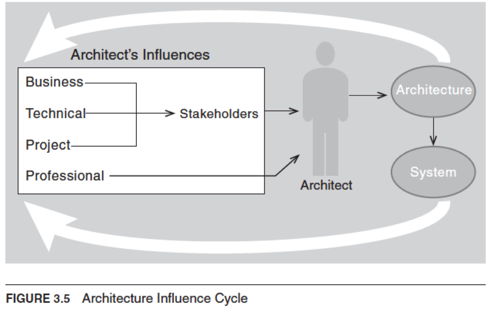

## Influence

### [Introduction](#)
- Architecture is not a product of a **dictator** developer or architect
- **Requirements** influence architecture
- Architecture is a result of **contexts**
- Architecture in turn affects these contexts that subsequently **influence** future architectures 
   1. [**Technical Context**](#)
      - Architecture can affect stakeholder **requirements** for the next system
      - Customers can receive a system in a more reliable, timely and **economical** manner when it is not built from scratch
      - Customers may **relax** some requirements to gain these economies
   2. [**Project Life-Cycle Context**](#)
      - Architecture affects the **structure** of the developing organisation
      - It presribes **units** of software that form the basis for the development project's structure
      - **Teams** become embedded in the organisational structure
   3. [**Business Context**](#)
      - Architecture affects the **business goals** of the developing organisation
      - A successful system enables a company to capture **market**
      - Architecture provides opportunities for **efficient** production of deployment of similiar systems
   4. [**Professional Context**](#)
      - System building affects the architect's **experience**
      - The architect will be more inclined to build systems using **simliar approaches** if the system is successful
      - Architectures that **fail** are less likely to be chosen for future projects

