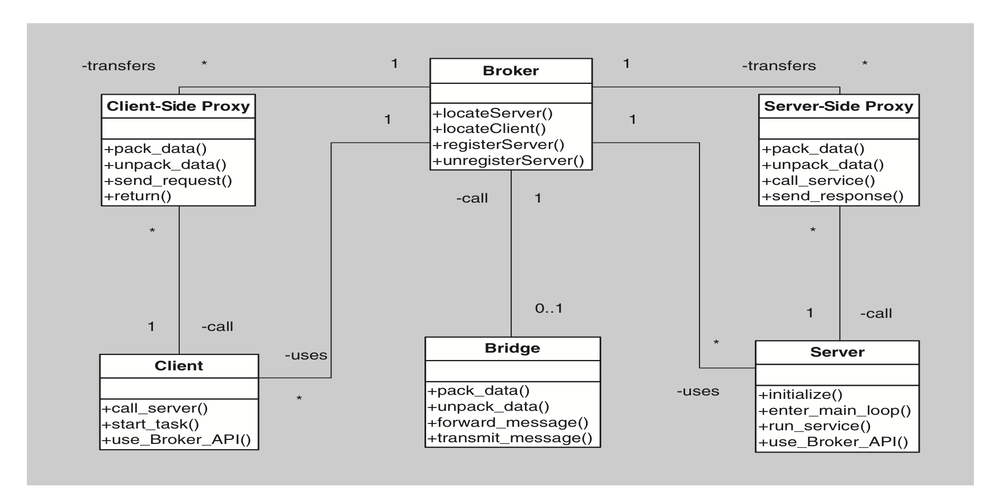

## Broker

### [Context](#)
- Many systems are constructed from a **collection of services** distributed across multiple servers
- Inmplementation is complex due to concerns regarding **interoperation and availability** of component services

### [Problem](#)
- How can distributed software be structured so that service users do not need to know the **nature and location** of service providers, making it easy to **dynamically** change the bindings between users and providers?

### [Solution](#)
- Separate users of services (Clients) from providers of services (Servers) by inserting an intermediary called **broker**

### [Elements](#)
1. **Client**
   - **Requester** of service
2. **Server**
   - **Provider** of service
3. **Broker**
   - **Intermediary** between client and server
   - **Locates** an apropriate server to fulfill a client's request
   - **Forwards** the request to the server
   - **Returns** the results to the client
4. **Client-side proxy**
   - Intermediary that manages actual **communication** with broker
      - Marshaling of messages
      - Sending of messages
      - Unmarshaling of messages
5. **Server-side proxy**
   - Intermediary that manages actual **communication** with broker
      - Marshaling of messages
      - Sending of messages
      - Unmarshaling of messages

### [Relations](#)
- **Attachment** relation associates clients (And optionally client-side proxies) and servers (And optionally server-side proxies) with brokers

### [Contraints](#)
- **Client** can only attach to broker (Potentially via client-side proxy)
- **Server** can only attach to broker (Potentially via server-side proxy)

### [Weaknesses](#)
- Brokers add a layer of **indirection**
- Increases **latency** between clients and servers
- Brokers can become communication **bottlenecks**
- Brokers can become single points of **failure**
- Brokers adds up-front **complexity**
- Brokers may be targets for **security** attacks
- Brokers may be difficult to **test**