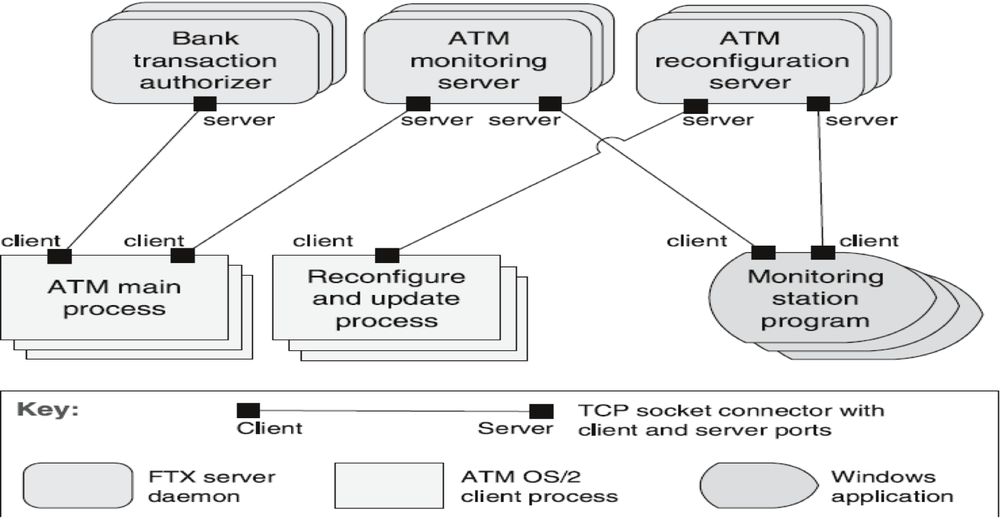

## Client-Server

### [Context](#)
- Shared **resources and services**
- Large number of distributed **clients** wish to access those resources
- **Access or quality** of services needs to be controlled

### [Problem](#)
- How can a set of shared resources and services be **managed** to promte modifiability and reusability?
- How can scalability and availability be improved by **centralising** control of resources and services while **distributing** them across multiple physical servers?

### [Solution](#)
- **Clients** interact by requesting services from servers
- **Servers** provide a set of services
- Some components can **act as both** clients and servers

### [Elements](#)
1. [**Client**](#)
   - **Invokes** services of server
   - Have **ports** that describe the services required
2. [**Server**](#)
   - **Provides** services to client
   - Have **ports** that describe the services provided
3. [**Request/Reply connector**](#)
   - Data connector that employs request/reply **protocol**
   - Used by **client** to invoke services of server

### [Relations](#)
- **Attachment** relation associates clients with servers

### [Contraints](#)
- **Clients** are connected to servers through request/reply connectors
- **Server** components can be clients to other servers

### [Weaknesses](#)
- Servers can be performance **bottlenecks**
- Servers can be single points of **failure**
- Decisions about where to locate functionality are **complex and costly** to change after the system is built