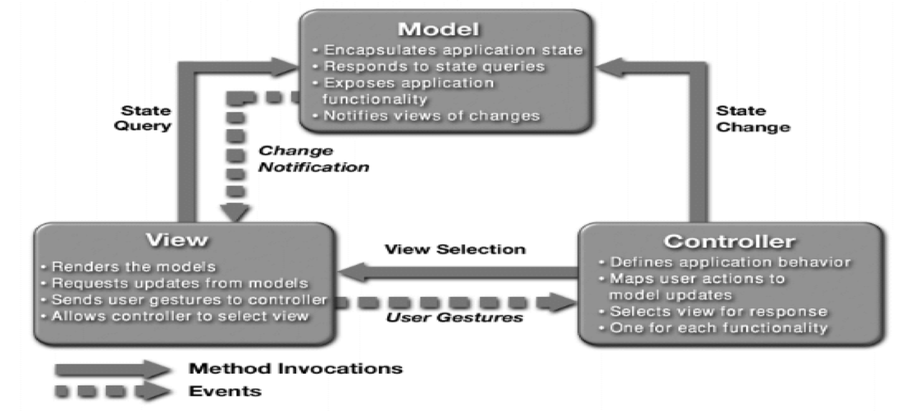

## Model-View-Controller

### [Context](#)
- **User interface** is typically most frequently modified in interactive applications
- Users wish to look at **data** from **different perspectives** (e.g. Bar graph and pie chart)
- The representations should all reflect the **current state** of data

### [Problem](#)
- How can **user interface** functionality be kept **separate** from **application** functionality and yet still be responsive to user input or changes in the underlying application **data**?
- How can **multiple views of user interface** be created, maintained and coordinated when the underlying data changes?

### [Solution](#)
- Separate application functionality into **three components**
   1. Model
   2. View
   3. Controller

### [Elements](#)
1. **Model**
   - Representation of application **data** or state
   - Contains or provides an interface to **application logic**
2. **View**
   - **User interface** component
   - Produces a **representation** of model for user
   - Allows for some form **user input** 
3. **Controller**
   - **Manages** the interaction between model and view
   - **Translates** user actions into changes to both model and view

### [Relations](#)
- **Notifies** relation connects instances of model, view and controller (MVC)
- Elements are notified of relevant **state changes**

### [Contraints](#)
- At least **one instance** of MVC each
- **Model** cannot interact directly with controller

### [Weaknesses](#)
- Complexity may not be worth it for simple user interfaces
- MVC abstractions may not be suitable for some user interface toolkits
