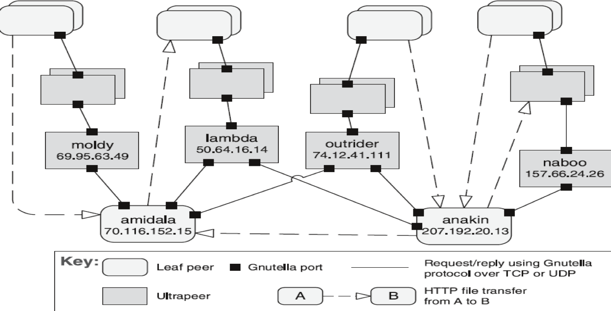

## Peer-to-Peer (P2P)

### [Context](#)
- **Distributed computational entities** that are **equally important** in terms of initiating interaction and providing resources
- They need to **cooperate and collaborate** to provide a service to a distributed community of users

### [Problem](#)
- How can a set of equal distributed computational entities be connected to one another via a **common protocol**?
- How can they **organise and share** their services with high availability and scalability?

### [Solution](#)
- Components directly interact as **peers**
- All peers are **equal** where no one can be critical for the health of the system
- Peer-to-peer communication is request/reply interaction **without assymmetry** as the one found in client-server

### [Elements](#)
1. [**Peer**](#)
   - Independent component running on a network **node**
   - **Special** peers can provide routing, indexing and peer search capability
2. [**Request/reply connector**](#)
   - Used to connect to the **peer network**, search for other peers and invoke services from other peers
   - **Reply** may sometimes be omitted

### [Relations](#)
- **Attachment** relation associates peers with their connectors
- Attachments **may change** at runtime

### [Contraints](#)
- Number of **allowable attachments** to any given peer
- Number of hops used for **searching** a peer
- Which peers **know** about which peers
- **Topology** of peers (e.g. Peers only connect to supernodes)

### [Weaknesses](#)
- Managing security, data consistency, data/service availability, backup and recovery are **complex**
- Small P2P systems may not be able to consistently achieve **quality goals** (e.g. Performance and availability)