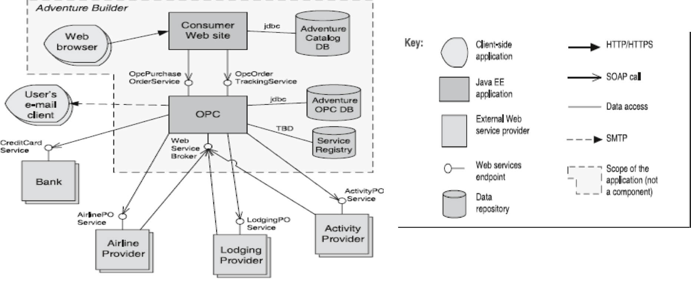

## Service-Oriented Architecture (SOA)

### [Context](#)
- A number of **services** are offered by service **providers** and consumed by service **consumers**
- Consumers need to understand and use the services without any detailed **knowledge of implementation**

### [Problem](#)
- How can we support **interoperability** of heterogenous components distributed across the Internet?

### [Solution](#)
- Describe a **collection** of distributed components that provide and/or consume **services**

### [Elements](#)
1. [**Service providers**](#)
   - **Provide** one or more services through published interfaces
2. [**Service consumers**](#)
   - **Invoke** services directly or through an intermediary
   - **Providers** can also be consumers
3. [**Enterprise Service Bus (ESB)**](#)
   - Intermediary element that **routes and tranforms messages** between providers and consumers
4. [**Registry of services**](#)
   - Used by providers to **register** services
   - Used by consumers to **discover** services at runtime
5. [**Orchestration server**](#)
   - **Coordinates** interactions between consumers and providers based on languages for business processes and workflows
6. [**Connectors**](#)
   1. **SOAP connector**: Uses SOAP protocol for synchronous communication between web services
   2. **REST connector**: Relies on basic request/reply operations of HTTP protocol
   3. **Asynchronous messaging connector**: Uses a messaging system to offer point-to-point or publish-subscribe asynchronous message exchanges

### [Relations](#)
- **Attachment** relation that attaches different components to the respective connectors

### [Contraints](#)
- Service consumers are **connected** to service providers
- **Intermediary** components (e.g. ESB, registry of services and orchestration server) may be used

### [Weaknesses](#)
- **Complex** to build
- **Evolution** of independent services cannot be controlled
- Performance overhead associated with **middleware**
- Services may be performance **bottlenecks**
- Services do not **guarantee** performance