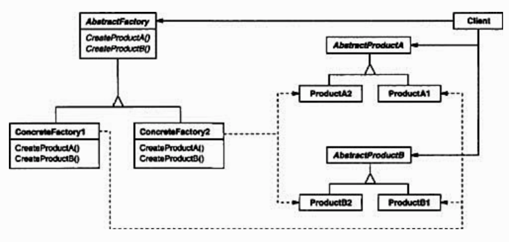

## Abstract Factory

 

### [Intent](#)
- Provide an interface to create **families of related or dependent objects** without specifying their concrete classes

### [Applicability](#)
- To design **families** of related ojects
- To ensure that the created products are **used together**

### [Consequences](#)
- Client is **decoupled** from any specifics of concrete products
- Instances are manipulated through their **abstract** interfaces
- It is hard to **extend** the abstract factories to produce new kinds of products

#### [Source code >>](abstract-factory/)