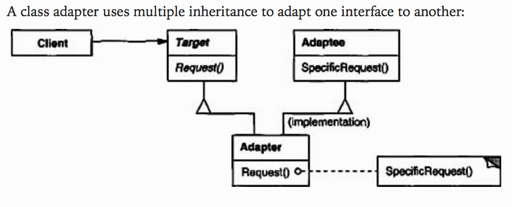
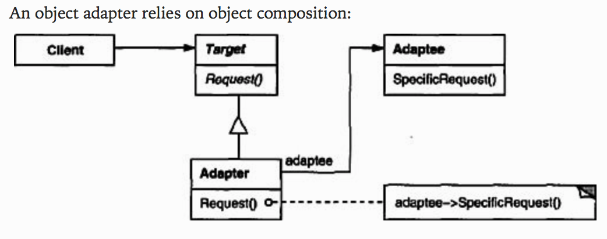

## Adapter

 
 

### [Intent](#)
- Convert **interface** of a class into another interface that the client expects
- Allow classes with **incompatible interfaces** to work together

### [Applicability](#)
- To match the **interface** of an existing class to what is needed
- To create a **reusable** class that cooperates with unrelated or unforseen classes that may not have compatible interfaces

### [Consequences](#)
- A **class adapter** commits only to one concrete adaptee class through **inheritance**
- It can **override** the adaptee class, but cannot adapt its subclasses
- An **object adapter** works with many adaptee classes through **composition**
- It **adds functionality** to all adaptee subclasses but cannot override them

#### [Source code >>](adapter/)