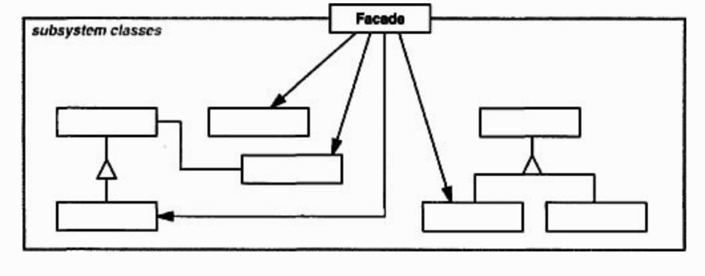

## Adapter

 

### [Intent](#)
- Provide a **unified interface** to a set of interfaces in a subsystem
- Define a higher-level interface to make the **subsystem** easier to use

### [Applicability](#)
- To provide a simple **interface** for a complex subsytem
- To **decouple** a subsystem from clients and other subsytems
- To define **entry points** for subsystems to communicate with each other

### [Consequences](#)
- Makes the subsystem **easier to use**
- Shields the clients from subsytem components, reducing the **number of objects** for clients to deal with
- Promotes **weak coupling** between subsystem and client, whereby the subsystem components can be changed without affecting the client
- Reduce **compilation** dependencies
- **Does not prevent** applications from using subsystem components

#### [Source code >>](facade/)