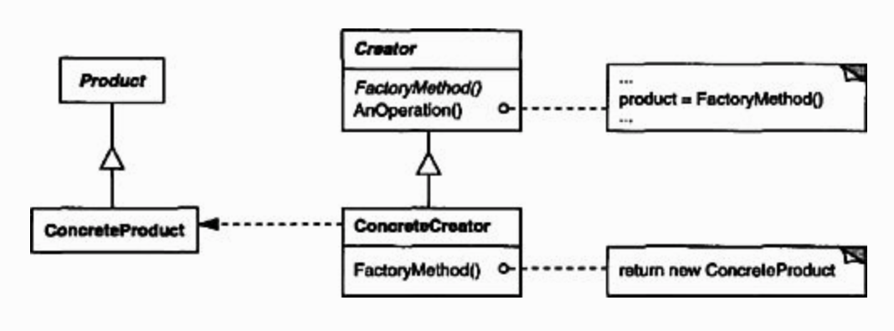

## Factory Method

 

### [Intent](#)
- Define an interface for **creating** an object
- **Defer** instantiation by letting **subclasses** decide which class to instantiate

### [Applicability](#)
- To address situations whre the class of objects to create **cannot be anticipated**
- To allow **subclasses** to specify the objects they create
- To **delegate** responsbility to helper subclasses and localise that knowledge in the delegates 

### [Consequences](#)
- Client code in superclass is **decoupled** from the object creation code in the subclasses

#### [Source code >>](factory-method/)