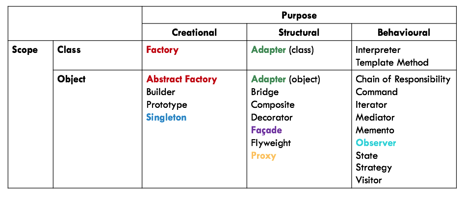

## Introduction

### [Design Pattern](#)
- Essential elements
   1. [**Name**](#)
      - **Handle** that describes a design problem, its solutions and consequences in a word or two
      - Common **vocabulary** for designers to communicate
      - Enables easier planning, thinking and **communication**
   2. [**Problem**](#)
      - Describes the appropriate **situation** for application
      - Explains the problem and its **context**
   3. [**Solution**](#)
      - Describes the **elements** that make up the design, their relationships, responsibilities and collaborations
      - **Abstract** description of a design problem and how a general arrangement of elements solves it
      - Not a particular **concrete** design or implementation
   4. [**Consequences**](#)
      - Results and **trade-offs** of application
      - To evaluate design **alternatives**
      - To understand **costs and benefits** of application

### [Categories](#)
1. [**Creational**](#)
   - Abstracts the **instantiation** process
      - **Encapsulate** knowledge about which concrete classes are used
      - **Hide** how instances of these concrete classes are created and combined
   - Gives **flexibility** in what gets created, who creates it, how it gets created and when it gets created
   - **Scopes**
      1. **Classes**: Use inheritance to vary the instantiated classes
      2. **Objects**: Delegate instantiation to another object
2. [**Structural**](#)
   - Concerned with how classes and objects are composed to form **larger structures**
   - **Scopes**
      1. **Classes**: Use inheritance to compose interface or implementations (e.g. Mixing multiple inheritances into one)
      2. **Objects**: Describe ways to compose objects to realise new functionality (e.g. Flexibility to change composition at runtime)
3. [**Behavioural**](#)
   - Concerned with algorithms and assignment of **responsibilities** between objects
   - Focuses on how objects are **interconnected** instead of control flow
      - Patterns of **objects**
      - Patterns of **communication** between objects
   - **Scopes**
      1. **Classes**: Use inheritance to distribute behaviour between classes
      2. **Objects**: Use object composition rather than inheritance
