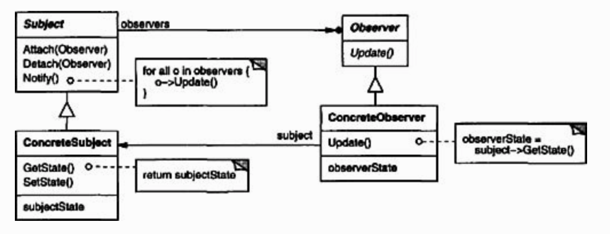

## Observer

 

### [Intent](#)
- Define a **one-to-many** dependency between objects
- When an object **changes state**, all its dependents should be **notified and updated** automatically

### [Applicability](#)
- To address situations where an observer depends on a **subject**
- To address situations where the **number of observers** is unknown
- To **decouple** the observers from the subject

### [Consequences](#)
- Subjects and observers can be **changed independently**
- **Observers** can be added without modifying the subject or other observers
- Subject only knows the **list of observers** but not their concrete classes
- Support for **broadcast** communication
- **Unexpected updates** to the observers from the subject

#### [Source code >>](observer/)