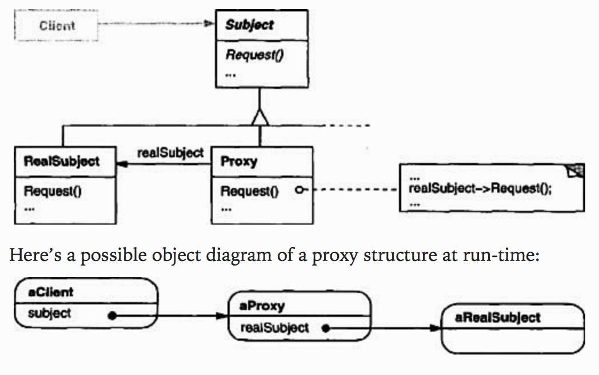

## Proxy

 

### [Intent](#)
- Provide a surrogate or **placeholder** for another object to **control access** to it

### [Applicability](#)
- To provide a more **versatile or sophisticated reference** to an object rather than a simple pointer
   1. **Remote proxy**: Provide local representative for a remote object
   2. **Virtual proxy**: Create expensive objects on demand
   3. **Protection proxy**: Control access to original object
   4. **Smart reference**: Perform additional action when an object is accessed

### [Consequences](#)
- Introduces a level of **indirection** when accessing object to
   - **Encapsulate** location of remote objects
   - Perform **optimisations** 
   - Allow additional **housekeeping** when objects are accessed
- Allow **copy-on-write** that only copies the object if it is modified to reduce the cost of copying objects 

#### [Source code >>](proxy/)