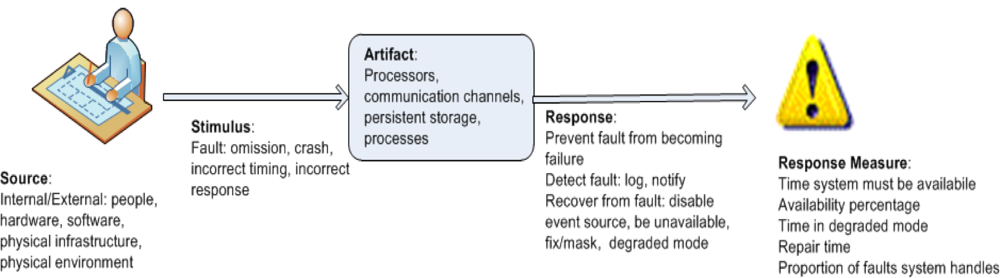

## Quality Attributes

### [Considerations](#)
1. **Untestable definitions**
   - Use **quality attribute scenarios** to characterise them
2. **Overlapping concerns**
   - Use **quality attribute scenarios** to characterise them
3. **Vast vocabulary**
   - Concentrate on underlying concerns to illustrate **fundamentals**

### [Specification](#)
- A common form is used to specify all quality attribute requirements as **scenarios**
   1. **Stimulus**: Condition that requires a response when it arrives at a system
   2. **Stimulus source**: Some entity that generated the stimulus
   3. **Response**: Activity undertaken as the result of arrival of stimulus
   4. **Response measure**: Response should be measurable in some fashion to test the requirement
   5. **Environment**: Conditions under which the stimulus occurs
   6. **Artifact**: Some artifact is stimulated
